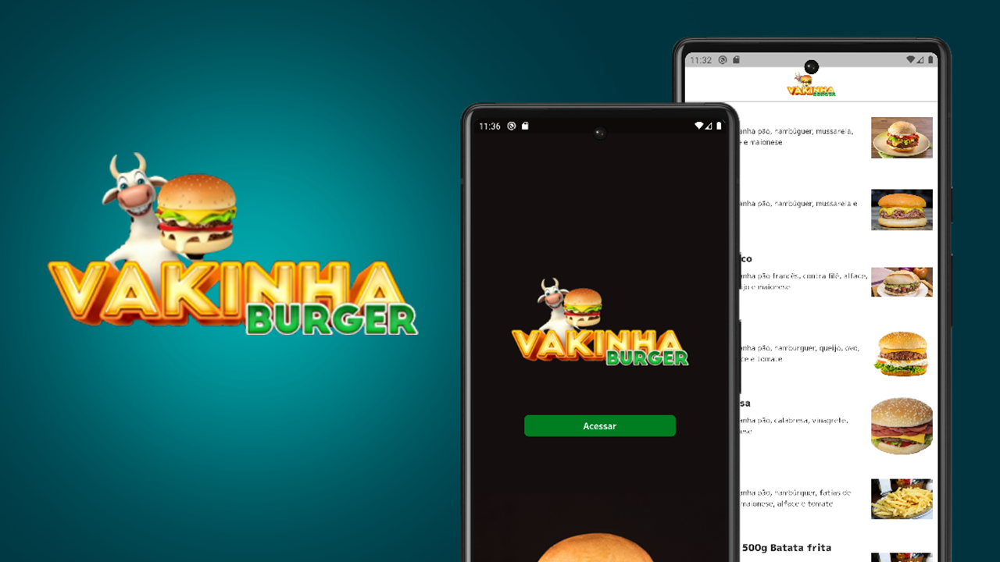

<div align="center">
  <h2 style="font-size:30px; font-weight: 700;">Vakinha Burguer</h2>
</div>

<p align="center" style="margin-top: 35px; width: 100%" >
  
</p>

<div style="margin-top: 30px;"/>

## 📝 Sobre o Projeto
Este projeto foi desenvolvido durante a 9ª edição da Dart Week - [Academia do Flutter](https://academiadoflutter.com.br)

<div style="margin-top: 30px;"/>

## 🛠️ Recursos explorados:
Durante o evento, exploramos várias features do Flutter, incluindo:

- Consulta de API utilizando o pacote Dio;
- Modelagem de Dados eficiente e flexível;
- Implementação do padrão de arquitetura BLoC para gerenciamento de estado;
- Testes e documentação das APIs utilizando Postman Collections;
- Personalização de temas para proporcionar uma aparência agradável e consistente;
- Utilização de DTOs (Data Transfer Objects) para transferência de dados eficiente;
- Gerenciamento de estado global utilizando a biblioteca de Providers;
- Utilização do Pattern Matching (match) para simplificar o código e melhorar a legibilidade;
- Criação de mixins para reutilização de código em diferentes partes do aplicativo;
- Extensões de classes para adicionar funcionalidades extras;
- Utilização de ambientes (Environments) para facilitar a configuração do aplicativo em diferentes cenários;
- Implementação do fluxo do Carrinho de Compras, permitindo aos usuários adicionar e gerenciar produtos selecionados;
- Implementação de um fluxo de Login e Logout seguro e confiável;
- Uso de Interceptors do Dio para manipular e modificar solicitações e respostas de API;
- Implementação de autenticação com tokens de autenticação e tokens de atualização (Refresh Tokens);
- Persistência de dados utilizando o pacote shared_preferences.


[Flutter](https://flutter.dev/)

<div style="margin-top: 30px;"/>

## 💻 Rodando o projeto

<div style="margin-top: 20px;"/>


```
É necessário ter o Flutter instalado.
https://flutter.dev/docs/get-started/install

O aplicativo consome os dados do backend, para isso configure json_rest_server:
https://pub.dev/packages/json_rest_server

- Instale as dependências
$ flutter pub get

- Execute:
$ flutter run

- Para o backend, instale o json_rest_server
$ dart pub global activate json_rest_server

- Crie um diretório do backend
$ json_rest_server create .\backend

- Entre no diretório:
$ cd backend

- Para inicializá-lo, execute o comando:
$ jrs run

```

